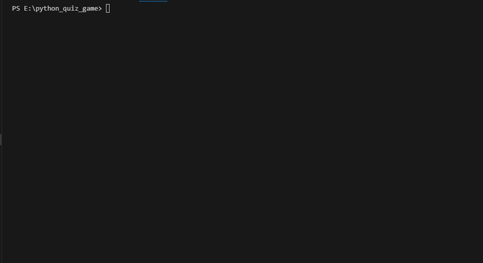
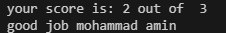

# Python Quiz Game


A simple quiz game built with python

## Table Of Contents
- [Features](#features)
- [Project Structure](#project-structure)
- [Requirement](#requirement)
- [Installation](#installation)
- [Envoirment Setup](#envoirment-setup)
- [Usage](#usage)
- [Example Output](#example-output)
- [Roadmap](#roadmap)
- [Screenshot](#Screenshot)
- [Contributing](#contributing)
- [Lincence](#lincence)
- [Aurthor](#aurthor)

## Features
- Quiz System
  - Asks the player multiple questions
  - Checks the answers automaticlly
  - Cakculate the final score
  - Result storage
    - Saves quiz results `results.txt`
  - Admin mode
    - asks for the admin password
    - check if the password is correct
    - keeps the private information outside the main python file
  - Loads the password from `.env`

## Project Structure

```text
python_quiz_game/
│   .env.example
│   .gitignore
│   main.py
│   question.py
│   quiz_demo_git.gif
│   README.md
│   requirments.txt
│
│
├───pictures
│       1.png
│       2.jpg
│       3.jpg
│
```

### File discription
| file | discription |
| --- | --- |
| `main.py` | main file used to run quiz game|
| `question.py` | stores questions and answeers|
| `requirment.txt` | lists the python packages needed for the project|
| `.env.example` | show the envoirment variables needed by the project|
| `.gitignore` | tells git which files and folders should not be tracked|
| `README.md` | contains the project documentation|
| `pictures/` | stores project screentshots|
| `pictures/1.png` | screentshot of the game start |
| `pictures/2.jpg` | screentshot of the quiz |
| `pictures/3.jpg` | screentshot of the final results |
| `gifs/` | store demo gif files |
| `quiz_demo_git.gif` | shows the project demo |


## Requirement
Before running the project, make sure you have:
- `python 3`
- `python-dotenv`

## Installation
1. open a terminal in the project folder.
2. check that python is installed:
```bash
python --version
```
3. install the python packages:
```bash
pip install -r requirements.txt
```

## Envoirment Setup
1. create a `.env` file from `.env.example`:
```bash
cp .env.example .env
```
2. open the new `.env` file
3. replace the example value with your own password
```text
QUIZ_ADMIN_PASSWORD=your_password_here
```
4. save the file
> Do not commit your `.env` file because it may contain private information.

## Usage
1. open a terminal in a project folder
2. run quiz game
```bash
python main.py
```
3. choose `yes` or `no` for admin mode
4. if you choose `yes`, enter the password from your `.env` file.
5. enter your name
6. answer the questions
7. see your final score and message
8. your result is saved in `results.txt`

## Example Output
do you want to open admin mode? yes/no: yes
enter admin password: 1234
admin! hi...

what's your name: mohammad 
welcome

what language are we use? c++
wrong

what command start a git? git init
correct

what command show git status? git status
correct

your score is: 2 out of  3
good job mohammad

## Roadmap
- [x] add multiple quiz question
- [x] calculate the final score
- [x] save results to a file
- [x] add admin mode
- [ ] add more quiz questions
- [ ] add difficultly levels
- [ ] add a timer

## Demo


## Screenshot
### start game


### quiz


### final score


## Contributing

## Lincence

## Aurthor
create by [mohammad amin](https://github.com/mohammadamin-pr)